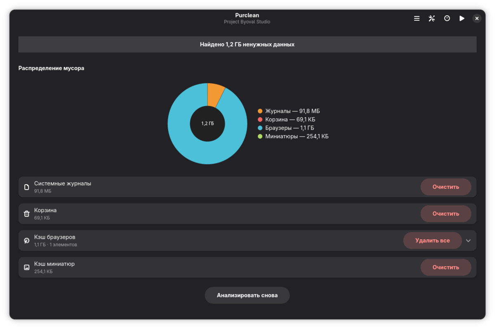

# Purclean
Приложение для очистки диска на Fedora Linux, написанное на Vala с использованием GTK4 и libadwaita.

## Возможности
- Удаление старых ядер Linux
- Очистка кэша Flatpak и Snap
- Удаление файлов AppImage
- Очистка больших загрузок
- Удаление журналов systemd
- Поиск и удаление сиротских пакетов
- Очистка кэша браузеров
- Очистка кэша миниатюр
- Очистка кэша DNF
- Управление данными Docker/Podman
- Поиск дублирующихся файлов
## Установка через Flatpak
bash
git clone https://github.com/byoval/purclean.git
cd purclean
flatpak-builder --user --install --force-clean build-dir com.github.byoval.purclean.yml

Зависимости для сборки

    flatpak-builder
    GNOME SDK 47

flatpak install flathub org.gnome.Sdk//47 org.gnome.Platform//47

Запуск

flatpak run com.github.byoval.purclean

Лицензия

GPL-3.0-or-later
